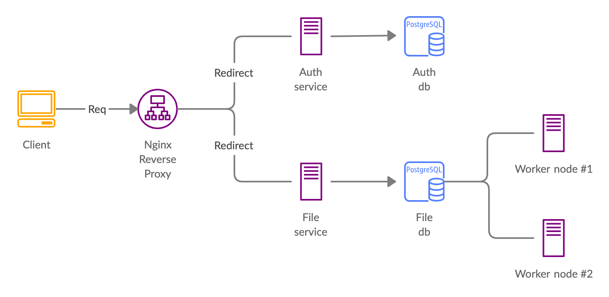

# Sensitivity-app

Sensitivity-app is a sample application designed in a micro-service architecture pattern. It is built upon [FastAPI](https://github.com/tiangolo/fastapi) and uses celery for the triggering periodic tasks.

---
## Quick start
To test out the repository, simply run:

~~~
docker-compose build && docker-compose up
~~~

> Go to http://www.localhost/api/file/docs or http://www.localhost/api/auth/docs for OpenAPI generated docs for file and auth microservice

## Developing locally
### Setting up the repo

This repoistory uses pipenv to do its environment management. In the root directory, run
~~~
pipenv install
pipenv shell
pre-commit install
~~~

Precommit is used to ensure high code quality by running [black](https://github.com/psf/black) formatting and flake8 linting checks before each commit.

> WARNING: The env files are shared here for convenience sake, please do not share env files when creating your own repo. To do so add env files into gitignore and do not commit these files

#### Running auth service
The following commands are to be run from the root directory unless otherwise stated.
Authentication service is done via oauth2 standards and using JWT tokens. To launch the service, run and go to http://www.localhost/api/auth/docs for docs

~~~
pipenv run start-auth

or

pipenv run start-auth-dev
~~~

#### Running file service
Launch the service from root directory and go to http://www.localhost/api/file/docs for generated docs
~~~
pipenv run start-file

or

pipenv run start-file-dev
~~~

---

## System architecture
The system is designed using microservicess architecture. The main componenets are: 
1. Auth service
   - Authenticate the user
2. File service
   - Upload files
   - Get all files
3. Celery beat
    - Task scheduler to push task on to queue regularly
4. Celery worker nodes
    - Worker nodes to carry out these tasks
5. Nginx load balancer
    - L7 load balancer to route to correct microservice
6. File DB & Auth DB
    - Seperate DB to hold SQL tables storing information
7. Redis
    - Use as the broker for celery queue

  

Diagram of system architecture
 

(Celery beat and redis queue not shown in this diagram)

## System design choices
- Microservices architecture
  - Allow faster development of subsequent services
  - Easier scalability of file service etc 
  - Stronger seperation of concerns for auth service and file service which are clearly different services

- Seperate DB for each service
  - Decouple services from each other

- Celery beat and celery worker as seperate container
  - Allow configurability in number of worker nodes easily
  - Allow configurability in choice of hardware for this machines
